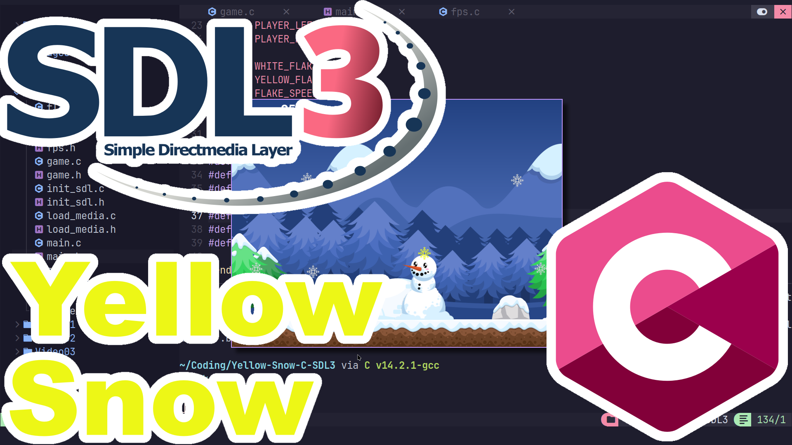

# Don't Eat the Yellow Snow! (C - SDL3)
Earn points by collecting all the tasty white snow flakes that fall. But watch out for the yellow snow.

# ArchLinux instructions.
You will need to make sure SDL3, SDL3_image, SDL3_ttf and SDL3_mixer is installed.
```
sudo pacman -S --needed base-devel sdl3
```
```
cd
git clone https://aur.archlinux.org/sdl3_image-git.git
cd sdl3_image-git
makepkg -i
```
```
cd
git clone https://aur.archlinux.org/sdl3_ttf-git.git
cd sdl3_ttf-git
makepkg -i
```
```
cd
git clone https://aur.archlinux.org/sdl3_mixer-git.git
cd sdl3_mixer-git
makepkg -i
```
```
cd
git clone https://github.com/ProgrammingRainbow/Beginners-Guide-to-SDL3-in-C
cd Beginners-Guide-to-SDL3-in-C
make run
```
The Makefile supports these commands:
```
make rebuild
make clean
make release
make debug
SRC_DIR=Video8 make rebuild run
```
# Controls
Left Arrow - Moves left.\
Right Arrow - Moves right.\
Space Bar - Resets the Game.\
Escape - Quits and closes game. \
M - Toggles muting the music. \
F - Prints FPS to the console.

